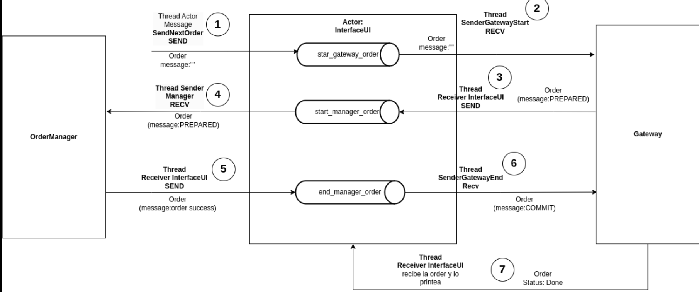
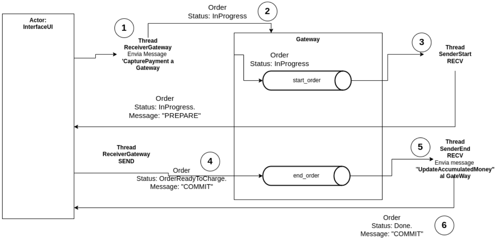
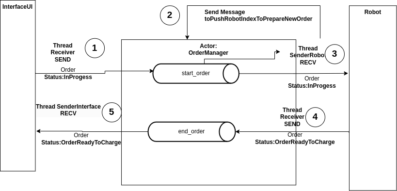
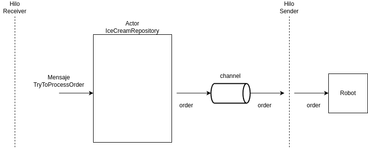

[](https://classroom.github.com/a/PKo6zpFB)

# TP2
### Video: 
1. Link al drive donde esta el video:
https://drive.google.com/drive/folders/1_WiDOUJ0K4m3jhAfCnA3JN0TeLYwRNnj?usp=sharing

## Arquitectura Propuesta
En el local tendremos 5 pantallas y cada pantalla vivira en un proceso independiente.
Las personas iran cada una a una pantalla y armaran su pedido (representado en un json).
### Helados:
En principio, existen 5 gustos de helados que se alamcenaran en un json el cual puede ser moficado a gusto del administrador del sistema
1. Gustos de helados :
   1. Chocolate
   1. Frutilla
   1. Vainilla
   1. Menta
   1. Chicle

1. Tamaños de contenedores existentes: 1. 250 g. 1. 500 g. 1. 1000 g. 1. 2000 g 1. 5000 g.
   El formato para los pedidos el siguiente:
```
{
  "pantallaId":0,
  "pedidosTotales":[
    { "pedidoId": 1,
          "tarjetaMonto":3000,
          "masaTotal":2000,
          "gustos":[
            {
              "Menta":1000,
              "Vainilla":250,
              "Frutilla":250,
              "Chicle":500
            }
          ]
    },
      {
          "pedidoId": 2,
          "tarjetaMonto":5000,
          "masaTotal":3000,
          "gustos":[
            {
              "Menta":1000,
              "Vainilla":500,
              "Chocolate":500,
              "Chicle":1000
            }
          ]
      }
  ]
}

```

# Actores 
En general por cada operacion bloqueante estamos lanzando un thread para que espere la operacion y no se bloquee nuestra aplicacion.
Se utilzan socket UDP de la std de Rust para garantizar la resilencia del sistema.

## InterfaceUI
Lee los pedidos desde un archivo mock JSON e interactua con el gateway para la aprobar/rechazar el pago y el orderManager para delegar la responsabilidad del pedido en la entidad.

### Threads: 
1. Thread Sender Gateway start: Se queda bloqueado en el recv de **start_gateway_order** , esperando que desde el message SendNextOrder del actor InterfaceUI pushee una nueva orden para enviar al gateway. 

2. Thread Sender Manager: Se queda bloqueado en el recv de **start_manager_order**, esperando que el thread Receiver le pushee una order para enviarlo al OrderManager.  

3. Thread Sender Gateway end: Se queda bloqueado en el recv de **end_manager_order** para luego enviar la order al gateway (con la operacion 'COMMIT' o 'ABORT').

4. Thread Receiver: Se queda bloqueado en el recv del socket escuchando si recibe alguna **order**. 


#### Resumen:
Hay como maximo 5 interfacesUI donde cada una se abre de forma independiente en una terminal. 
Se espera que una Order se ha procesada de a uno una vez (en forma paralaleo para cada interfazUI) una vez terminada el order se pasa a la sgt order.  
### Mensajes:
1. **SendNextOrder**: Se envia un mensaje a la interfazUI para que haga send al channel start_gateway_order para comenzar la order.
   


## Gateway:
**Gateway**: El sistema debe manejar la captura de pagos al momento de realizar el pedido y el cobro efectivo al
entregar el helado chequeando si hay stock correspondiente y una funcion de prbabilidad que puede rechazar la tarjeta o no. 
Cada gateway esta asociado a una interfaz porque pensamos que un gateway es como la caja de moneda de una maquina de chicles, 
tiene los atributos dineroAcumulado y dineroBloqueado.

### Mensajes: 
1. **CapturePayment**: Recibe la orden y chequea si tiene el monto necesario para pagar la orden, y tambien aplica
la funcion probabilidad para rechazar/aceptar la tarjeta.
1. **UpdateAccumulatedMoney**: Chequea el valor del message del orde en caso de COMMIT acumula el dinero bloqueado y lo setea en cero, en caso de  ABORT, pasa el dinero bloqueado a cero.


## OrderManager
Es el que gestiona las orders que vienen desde todas las interfacesUI y es que envia una order a un robot que esta libre o random si todos estan ocupados.

### Threads:
1. Thread Receiver: Se queda bloqueado en el recv de socket, esperando nueva orders.
1. Thread SenderRobot: Se queda bloqueado en el recv de **star_oder**, esperando que el thread Receiver le pushee una order para luego delega la logica para obtener el indice del robot a enviar al Actor OrderManager obtiene el indice y lo envia al robot respectivo.
1. Thread SenderInterfaces end: Se queda bloqueado en el recv de **end_order** para luego enviar la order a la interfaceUI correspondiente.


### Mensajes: 
1. **PushRobotIndexToPrepareNewOrder**: Realiza la logica para poder obtener el indice del robot (Del vector de conexiones a robot) a realizar la order, manda el 
indice el primer robot **Free** que encuentre, si todos estan ocupados elige uno aleatorio y pushea el indice por el channel decide_robot.

## Robot
Encargado de recibir los pedidos, cuando obtiene el acquire entra a la seccion critica envia un order al IceCreamRepository y luego cuando la recibe el order hace el release,
despues se queda esperando un tiempo (bloqueado para enfriar motores), la cantidad de tiempo esta encapsulado en el message: **CoolingTheEngine** el tiempo (usize) se pushea al channel

**tx_wait_order**  el thread receiver duerme y cuando despierta pushea la order al channel **tx_end_order** el thread sender obtiene la order y la envia al OrderManager.
### Threads:
1. Thread Receiver: Se queda bloqueado en el recv de socket, recibe la order del IceCreamRepository y luego espera el tiempo correspondiente y pushea luego la order al channel tx_start_order. 
1. Thread Sender: Se queda bloqueado en el recv **rx_start_order** , una vez que le pushea la order (el receiver) toma el acquire, envia una order al IceCreamRepo, y hace el release luego se queda bloqueado esperando a que el thread receiver le pushea una order en el channel rx_end_order para envia la order al OrderManager.


**Supuesto**: Si el robot falla al hacer el helado (No hay stock de todos los gustos), no espera el tiemppo  por hacer el helado (porque no lo hizo)
y manda un mensaje al OrderManager el pedido con status Failed.


Utiliza el algoritmo de token ring para garantizar que solo un robot a la vez tenga acceso al 
IceCreamRepository para obtener los ingredientes necesarios.
El robot manda un "Hello" al orderManager y este guarda su id y su address para luego comunicarse con este.
Luego el robot envia solo orders al orderManager cuando este termine su procesamiento. 
Mensajes:CoolingTheEngine **


**IceCreamRepository**: Almacena los contenedores con los sabores de helado disponibles y gestiona el stock.
Cada contenedor debe ser accesible de manera exclusiva por un único robot en un momento dado para evitar
conflictos de concurrencia. Para esto usamos el algoritmo de token ring quien tiene el token es el unico habilitado
a mandarle por socket udp la Order (nuevamente) y este le responde con mensaje "Exito" o "Fracaso".

Este modulo tendra dos hilos:

hilo receiver: recibe la orden

hilo serder: envia las orden con el status modificado dependiento de si se pudo realizar o no al robot que envio el pedido

El hilo receiver al recibir un pedido crea un mensaje TryToProcessOrder con el pedido y el el address del robot que envio el pedido luego manda el mensaje al actor IceCreamTasteRepository.

El actor IceCreamTasteRepository al recibir un mensaje TryToProcessOrder procesara el pedido. En caso de que el pedido se pueda realizar modificara el stock y cambiara el estado del la orden a OrderReadyTocharge. En caso de que no se pueda realizar el pedido se pondra el status en Failed. y se pondra la orden en el canal para que el hilo sender lo envie al robot.



### RingDistMutex:

1. Se hace uso de algoritmo de token ring para crear un mutex resiliente, en caso de que se le pase un token al id siguiente
   y este no responda en un tiempo determinado, se le pasa el token al siguiente, (es resiliente)💪🏾.
2. La arquitectura de su funcionamiento se representa en la sgt imagen:
   
   En la imagen de arriba vemos que el nodo 1 le manda el token al nodo 2 este luego de recibirlo responde con un ACK para decirle que lo recibio exitosamente.
   Luego el nodo 2 hace el acdquire puede ejecutar la seccion critica y luego el release. Pasando el token al proximo nodo. (Nodo3).
   En el caso 2 el Nodo1 manda el token al Nodo2 (este esta caido), luego de segundos hace un TIEMOUT y este le pasa el token al siguiente del nodo caido.
   


### Definicion de Puertos:
Siendo x el id del objeto correspondiente: 
EJ: interface con id = 2, tendra el address asociado: "127.0.0.1:12342"
1. Interfaces: puertos 1234x (5 procesos)
1. Gateway puertos 1235x  (5 procesos) (cada proceso esta asociado a un gateway)
1. OrderManager: puertos 12356 (1 proceso)
1. TokenRing puertos: 1345x (3 procesos 1 por cada robot).  
1. Robots puertos: 1237x (3 procesos)
1. IceCreamRepository puertos 12380 (1 proceso)

## Ejecucion del sistema
1. El archivo run.sh contiene un script en bash para compilar y ejecutar de forma automatica todos los sistemas
Actualmente lo ejecuta con 3 interfacesUI (con sus 3 Gateway respectivos) , 3 robots.

```bash
$ chmod +x run.sh
```

3. Una vez que le dimos permisos de ejecucion, ejecutamos:

```bash
$ ./run.sh
```
4. Finalmente se compilara el proyecto y se lanzaran las terminales robot, gateway, interfaces, ordermanager y repository.

Tambien podemos ejecutar de forma casera otro caso como por ejemplo: Aca levantamos 5 interfaceUI con sus gateway. 

```bash
cargo run --bin order
cargo run --bin repo
cargo run --bin robot 2
cargo run --bin robot 1
cargo run --bin robot 0

cargo run --bin gateway 0
cargo run --bin gateway 1
cargo run --bin gateway 2
cargo run --bin gateway 3
cargo run --bin gateway 4

cargo run --bin interface 0
cargo run --bin interface 1
cargo run --bin interface 2
cargo run --bin interface 3
cargo run --bin interface 4
``` 
### Enunciado
https://concurrentes-fiuba.github.io/2024_1C_tp2.html
